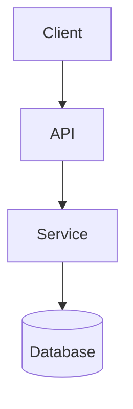

# Mapping Architecture

Use this skill when the user asks to understand a codebase, explain how a system works, map data flow, document architecture, assess boundaries, or produce an architecture decision record.

Start with the system that exists. Do not recommend rewrites, migrations, or new frameworks until the current structure, constraints, and failure modes are mapped with evidence.

## Workflow

1. Scan the system boundaries.
   Identify manifests, entry points, routes, workers, scheduled jobs, CLI commands, database models, storage clients, queues, external integrations, and deployment hints.

2. Phase 1: produce a Mermaid diagram before prose analysis.
   Make the diagram the first substantive output. Show entry points, services, data stores, async paths, external dependencies, and trust or failure boundaries when visible.

3. Phase 2: iterate per node.
   Walk the diagram one component at a time. For each node, cite evidence, explain responsibility, data in, data out, dependencies, and failure modes.

4. Trace critical data paths.
   Follow important flows from entry point to processing to storage or side effect. Include async branches and background work.

5. Identify constraints and trade-offs.
   Name core conflicts such as consistency vs. availability, speed vs. cost, simplicity vs. flexibility, or isolation vs. operational overhead.

6. Produce an ADR only when the user asks for a decision.
   Compare at least two viable options, state the selected path, and list positive and negative consequences.

## Evidence Discipline

- Cite file paths, symbols, routes, config files, schemas, commands, or manifests for each mapped component.
- Mark anything you cannot confirm as **unconfirmed** or **context missing**.
- Do not infer external infrastructure beyond what files, configs, docs, or runtime evidence show.
- Separate "how it works now" from "how it should work."

## Output Format

Use this structure. The Mermaid diagram must appear before prose analysis:

````markdown
### Architecture Map


### System DNA
- **Architecture**: <monolith, modular app, service mesh, event-driven, etc.>
- **Key Stack**: <languages, frameworks, storage, queues>
- **Entry Points**: <routes, jobs, CLIs, apps>
- **Infrastructure Hints**: <only what evidence supports>

### Component Walk
| Node | Responsibility | Evidence | Data In | Data Out | Failure Modes |
| :--- | :--- | :--- | :--- | :--- | :--- |
| API | <role> | `<file-or-symbol>` | <input> | <output> | <risk> |

### Critical Data Paths
1. **<flow name>**: `<entry>` -> `<component>` -> `<store/side effect>`.

### Risks and Unknowns
- **Confirmed**: <risk with evidence>
- **Unconfirmed**: <missing context>

### ADR
Include this section only when the user asks for an architecture decision.
- **Title**: <short decision title>
- **Status**: Proposed | Accepted
- **Context**: <problem and constraints>
- **Options**: <at least two viable paths>
- **Decision**: <chosen path>
- **Consequences**: <positive and negative>
````

Part of CDLI Agent Skills by CDLI - https://cdli.ai
